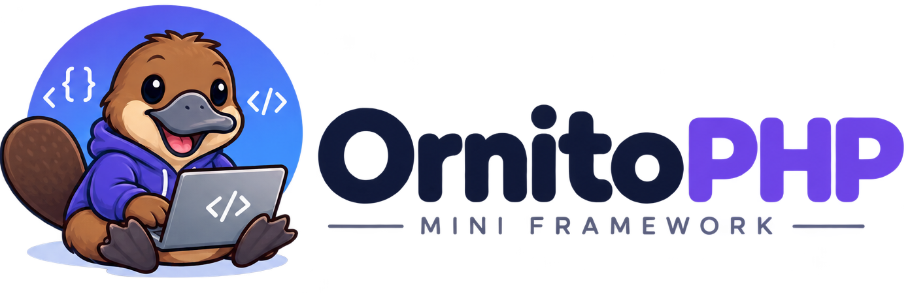

<p align="center">
  
</p>

<h3 align="center">A tiny educational PHP 8.4 framework — built to be read.</h3>

<p align="center">
  <a href="https://packagist.org/packages/ornitophp/starter"></a>
  <a href="https://packagist.org/packages/ornitophp/starter"></a>
  <a href="https://packagist.org/packages/ornitophp/starter"></a>
</p>

---

## What is this?

OrnitoPHP is not another "Laravel killer." It's the opposite: a framework that shows you how the blocks work **without** hiding them behind abstraction layers.

Born from [sprinf](https://github.com/kheredia04/sprinf), rebuilt from scratch on modern PHP 8.4. Same instincts (single front controller, declarative routes, base model/controller), different philosophy: every decision has a *why* in the docblocks.

**This is the starter template.** Clone it and you have a working app with auth, sessions, migrations, and a dark/light theme — ready to learn or build.

```bash
composer create-project ornitophp/starter my-app
cd my-app
php bin/ornito migrate
php bin/ornito db:seed
composer serve
```

## Why OrnitoPHP?

### 1. Security as architecture, not as a feature

Most frameworks give you security as an add-on layer. OrnitoPHP has it in the bone:

- **Prepared statements everywhere** — not a single string interpolation in the codebase
- **SQL identifiers validated with regex** before they reach the database (defense in depth)
- **Superglobals quarantined** — only `Request::capture()` touches them
- **CSRF with timing-safe validation** (`hash_equals`), exempt for `/api` segments
- **Open-redirect prevention** in `AuthController::safeTarget()`
- **Layered login throttling** — account|ip, pure IP and pure account
  buckets checked together, so rotating emails or IPs cannot dodge the cap
- **File-backed rate limiting** with zero external dependencies

This isn't a framework that "can be secure." It's one where SQL injection is **structurally difficult**.

### 2. Zero-dependency philosophy

**Runtime dependencies: 2.** `vlucas/phpdotenv` + `firebase/php-jwt`. That's it.

Everything else — Router, Pipeline, Request, Response, Session, Validator, RateLimiter, QueryBuilder, ErrorRenderer — is written from scratch. Not because reinventing the wheel is cool, but because **understanding the blocks matters more than using them**.

### 3. The Response contract

Controllers **return** `Response` objects. The kernel calls `send()` exactly once. No scattered `echo`, no void returns, no "responses were never sent" mystery.

This is the kind of decision that separates "I know PHP" from "I understand software architecture."

### 4. Real educational content

This isn't a framework you document *after*. It's designed to be read:

- Every decision has a **why** in the docblocks
- The `docs/` folder explains design rules — not just API reference
- The query builder shows the SQL it runs (`toSql()`, `toPreviewSql()`) — no hidden queries
- `explain()` / `php bin/ornito explain "<SELECT sql>"` reveal HOW MySQL runs each query
- The debug bar (footer when `APP_DEBUG=true`) counts queries per request and flags N+1 patterns
- The test suite **is** the living documentation (208 tests, 630 assertions)
- Edge cases are tested and explained

### 5. Dual error negotiation

The `ErrorRenderer` automatically decides between HTML and JSON based on the `Accept` header or `/api` path prefix. Real content negotiation — the same endpoint serves browsers and APIs without duplicating logic.

### 6. Strength through restraint

No DI container. No ORM. No Blade. And that's a **feature**:

| Without... | You get... |
|---|---|
| DI Container | Explicit, visible wiring |
| ORM | Honest SQL with prepared statements |
| Blade | Plain PHP templates — no magic, no learning curve |

## Quick start

```bash
# Create a new project
composer create-project ornitophp/starter my-app
cd my-app

# Configure environment
copy .env.example .env    # Edit with your MySQL credentials

# Set up database
php bin/ornito migrate
php bin/ornito db:seed    # Creates demo user: pato@ornitophp.dev / platypus123

# Start development
composer serve            # http://localhost:8080
```

## Console commands

```bash
php bin/ornito migrate              # Apply pending migrations
php bin/ornito db:seed              # Seed demo user
php bin/ornito db:fresh             # Destructive: drop all → migrate → seed
php bin/ornito create:model         # Generate model + migration
php bin/ornito create:controller    # Generate controller
php bin/ornito create:relation      # FK/pivot migration + relationship methods
php bin/ornito explain "<SELECT sql>"  # Show how MySQL would run a SELECT
php bin/ornito show:auth-module     # Enable login/register pages
php bin/ornito hide:auth-module     # Disable login/register pages
```

## Visual presets

One line in `.env` changes the entire look:

```env
APP_STYLE=app        # Hand-written dark theme (default)
APP_STYLE=bootstrap  # Bootstrap 5 CDN + dark overrides
APP_STYLE=tailwind   # Tailwind CDN + semantic bridge
```

The views never change. Only the CSS loads differently. That's the Strategy pattern applied to UI.

## Project structure

```
├── public/              # Front controller + static assets
│   ├── index.php        # Single entry point
│   └── assets/          # CSS, images
├── app/                 # Your code (App\ namespace)
│   ├── Controllers/     # AuthController, HomeController
│   ├── Middleware/       # Authenticate
│   └── Models/          # User
├── config/              # app.php, auth.php, session.php
├── database/            # Migrations (SQL files)
├── routes/              # web.php, api.php
├── views/               # PHP templates
│   └── errors/          # Branded error pages
├── storage/             # Runtime: logs, rate limits, auth flag
├── docs/                # Framework documentation
└── tests/               # PHPUnit test suite
```

## Documentation

- [Getting Started](docs/getting-started.md)
- [Routing](docs/routing.md)
- [Middleware](docs/middleware.md)
- [Database](docs/database.md)
- [Validation](docs/validation.md)
- [Error Handling](docs/error-handling.md)
- [JWT Authentication](docs/jwt-auth.md)
- [Console Commands](docs/console.md)
- [Login Throttling](docs/security.md)

## License

MIT
